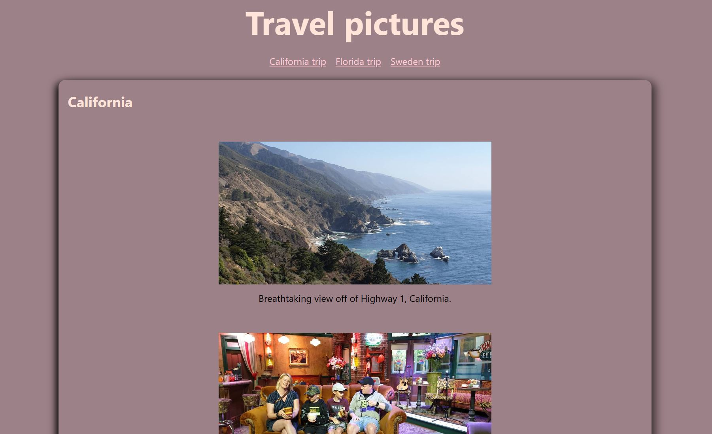
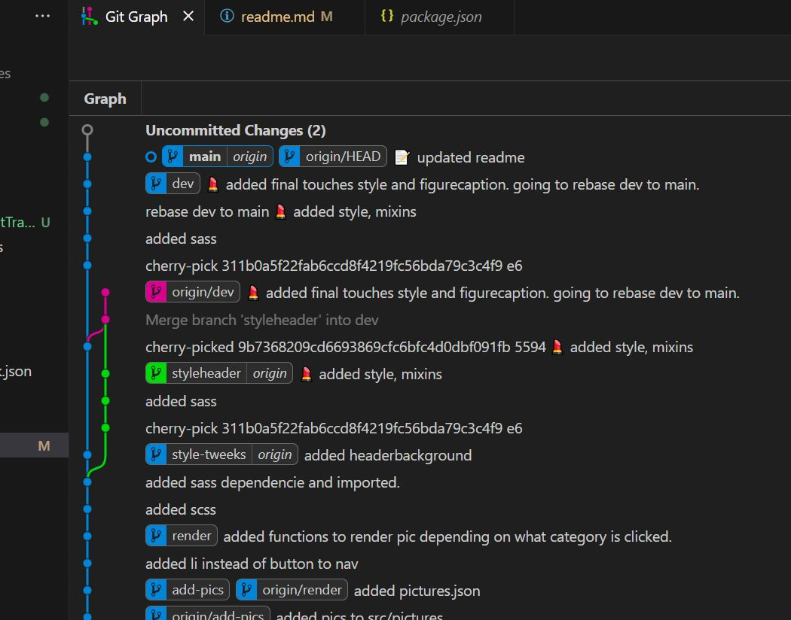

# School assignment to play around with git

This is a little project for school, Medieinstitutet. We had to play around, try and fail, and fix with git. I chose to do a little application to show some pictures from travels. 

## Tech used

## Screenshots

## Authors
 
- [@Annika-Nyholm](https://www.github.com/Annika-Nyholm)